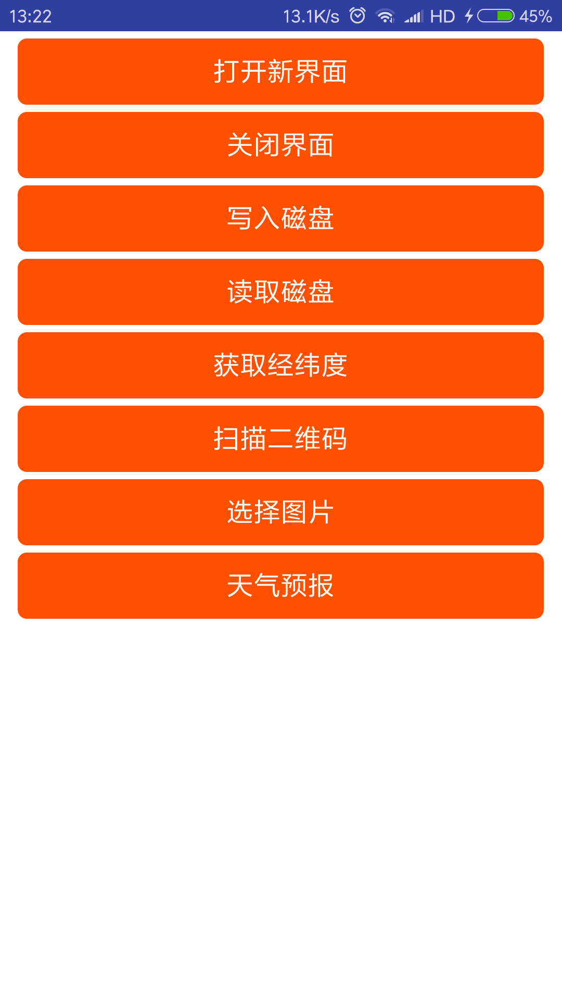
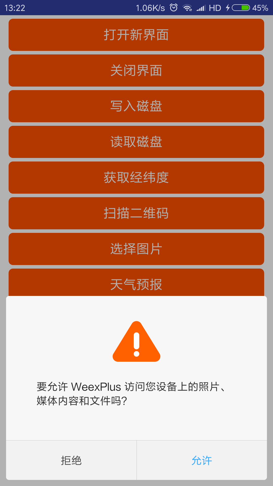
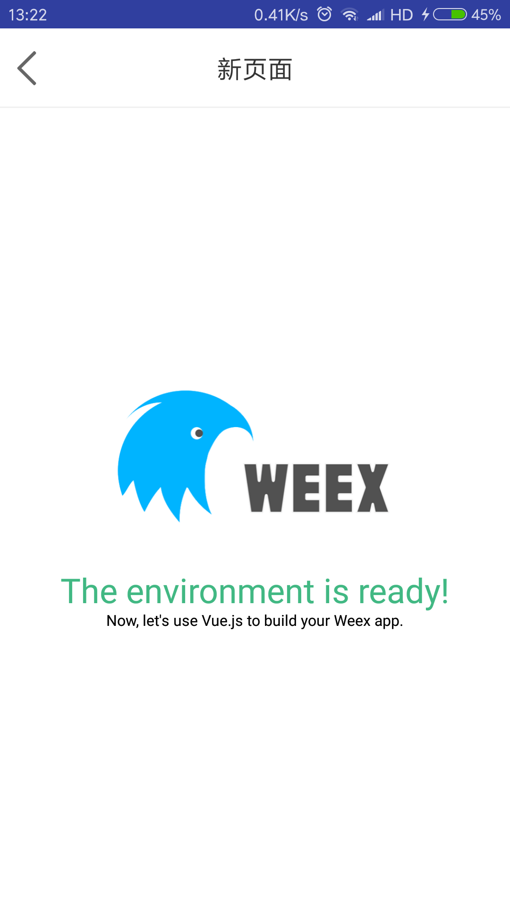
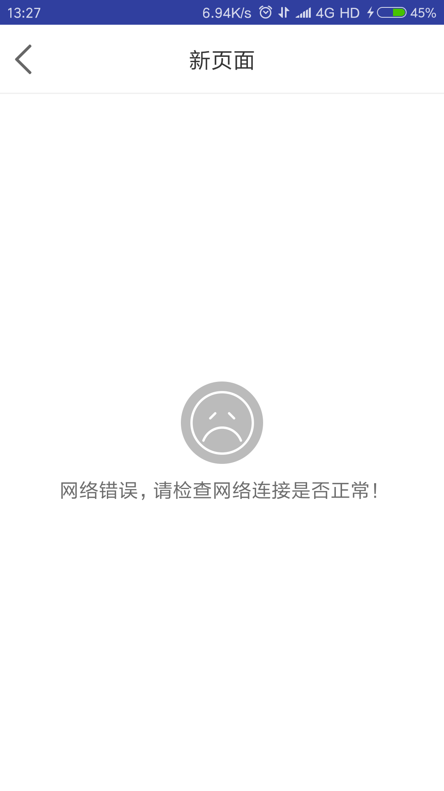
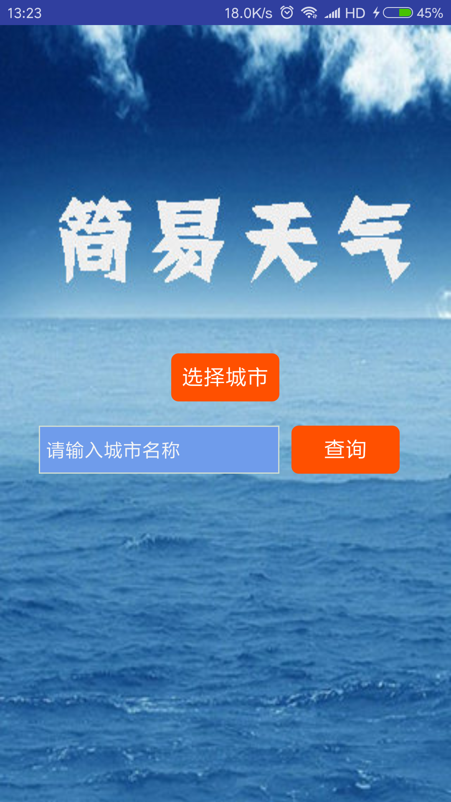
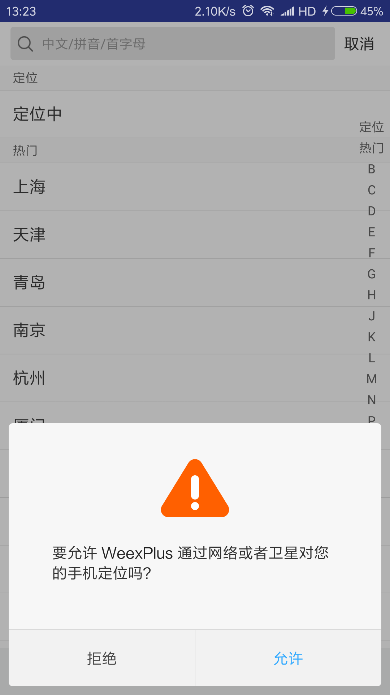
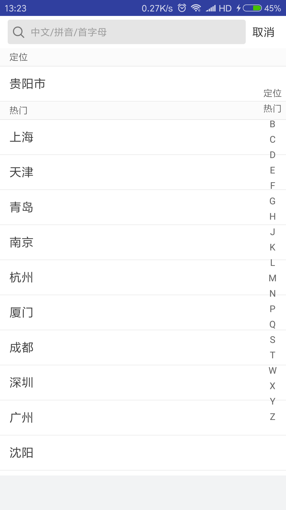
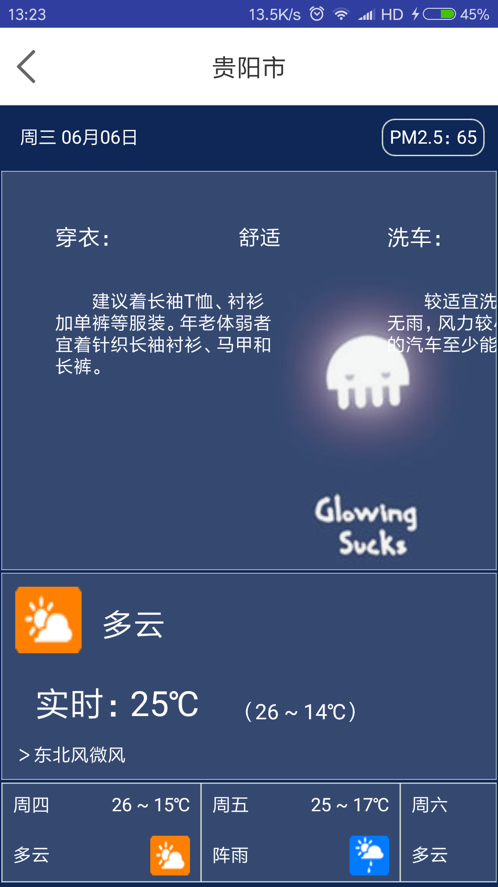

# WeexPlus【暂停维护】

为解决目前移动开发频繁的迭代、开发周期长、人员成本高的问题，移动跨平台开发方案层出不穷。 **WeexPlus则是一款基于阿里[weex](http://weex.apache.org/cn/)跨平台方案(android/ios/h5)开发的weex端与android native交互的组件扩展库，提供页面导航、数据存储、图片选择、二维码识别、权限等原生功能**。web开发者不用再为调用native功能而烦恼，android开发者轻松搞定hybrid开发。

如果你想采用纯原生快速开发方案，请移步：[MVVMHabit](https://github.com/goldze/MVVMHabit)

## 框架特点
- **快速集成**

	不管是web开发者，还是android开发者，都可以快速的集成此库。

- **事件模式**

	整体使用事件派发思想，weex与native完全解耦，方法调用相互不依赖。weex端指定唯一的Action(动作)，native端会根据Action做出判断，执行对应的逻辑，响应结果。

- **页面加载器**

	WeexPlus提供一个原生的页面加载器，只需要传入JSBundle文件路径(本地/网络都可以)，会自动渲染页面，并带有material design加载效果。加载失败显示错误信息，可点击重新加载。
## 缺点
- **只提供android端native交互库，ios端暂无支持**

## 1、准备工作
> WeexPlus基于Weex技术，Weex 是一个使用 Web 开发体验来开发高性能原生应用的框架，所以你需要掌握一定的Weex开发知识。[相关文档](#xgwd)

根据官方介绍配置安装weex开发环境

### 1.1、android视角
WeexPlus是集成了[weex_sdk](https://github.com/apache/incubator-weex)、[glide](https://github.com/bumptech/glide)、[rxpermissions2](https://github.com/tbruyelle/RxPermissions)、[rxjava2](https://github.com/ReactiveX/RxJava)、[matisse](https://github.com/zhihu/Matisse)、[zxing](https://github.com/zxing/zxing)、[material](https://github.com/rey5137/material)的一套android library。提供了页面导航、数据存储、图片选择、二维码识别、权限等原生功能给weex端调用，节约了自己再去开发这样一套库的时间成本。

不管你是做hybrid开发，还是纯跨平台开发，android端直接依赖此库(业务逻辑交给前端去搞定 罒ω罒)。

#### 1.1.1、依赖方式

- **源码依赖：** 下载例子程序，直接import weexplus module

- **远程依赖：** 
```gradle
    //添加仓库支持
    repositories {
        ...
        maven { url 'https://jitpack.io' }
    }
    //远程依赖
    implementation 'com.github.goldze:WeexPlus:1.0.0'
 ```

建议使用源码依赖的方式，方便业务扩展。
#### 1.1.2、配置Application

继承**weexplus**中的**WeexApplication**，或者在你Application的onCreate方法中调用：

```java
WeexApplication.initialize(this);
```
#### 1.1.3、混淆
```java
-keep class me.goldze.weex.** { *; }
-dontwarn me.goldze.weex.**
```
### 1.2、web视角

WeexPlus可以让你在没有android开发人员的情况下，满足native功能调用的需求。

#### 1.2.1、依赖方式
下载例子程序，将 **android** 文件夹整个放入weex目录的 **platforms** 下，不再需要命令weex platform add android生成android程序。

#### 1.2.2、配置app
项目集成好后，通过android studio打开android项目，找到app/src/main/res/values/strings.xml，修改app名称和第一个页面入口url的值。
```xml
<!--app名称-->
<string name="app_name">WeexPlus</string>
<!-- 入口url 换成你自己的第一个页面文件，可以是本地, 也可以是网络 -->
<string name="entrance_url">file://main_demo.js</string>
```

集成好后执行 ```weex run android``` 看效果

## 2、weex调用
导入 **WeexPlus** 的 **AppModule** 组件

```javascript
//App原生通信模块
const appModule = weex.requireModule("AppModule");
```
通过调用** appModule.event(string,map,function,function) **方法，来实现与native的通信。其中，

第一个参数string：代表action，指调用功能的动作，是打开页面还是关闭页面还是选择图片；</br>
第二个参数map：需要传入的参数；</br>
第三个参数function：逻辑成功的回调；</br>
第四个参数function：逻辑失败的回调。</br>

所有与本地方法的通信都是按照此结构来操作。

### 2.1、页面导航
#### 2.1.1、打开页面
打开一个带有页面加载器的新页面
```javascript
appModule.event(
    "START_PAGER",
    {
        url: geRootIp() + "/dist/index.js",
        title: "新页面",
        data: {}
    },
    function(e) {
        //页面打开完成的回调
    },
    function(e) {
        //页面打开失败的回调
    }
);
```
START_PAGER：动作名，表示需要打开一个新页面；</br>
url：新页面JSBundle文件路径；</br>
title：新页面的标题；注意：当值为NO_NAVIGATION时不显示标题栏；</br>
data：需要传入到下一个界面的参数。

如果需要将参数传入下一个页面，这里提供了两种方法：

- 一种是，将参数放入url中，例如http:...?user=123&psw=abc，新页面通过weex.config.bundleUrl拿到当前url，通过字符串截取的方式取出参数值。
- 另一种是，在新页面的created方法中，获取data字段传入过来的数据(推荐)。
```javascript
    created: function () {
      globalEvent.addEventListener("init", function(e) {
		//e.data即是上个页面data字段传过来的值
        console.log(e.data);
      });
    },
```
#### 2.1.2、关闭页面
关闭当前界面
```javascript
appModule.event(
    "CLOSE_PAGER",
    {},
    function(e) {
        //页面关闭完成的回调
    },
    function(e) {
        //页面关闭失败的回调
    }
);
```
CLOSE_PAGER：动作名，表示需要关闭当前界面。

### 2.2、数据存储
这里说明一下：本身weex提供了storage模块, 为什么这里又要自己写一个SharedPreferences存储呢？为的是weex与原生更好的通信。比如混合开发时, 登录界面是原生界面，登录成功后本地保存用户唯一标识，当进入weex界面时可以通过该模块取出用户唯一标识，实现相应逻辑。
#### 2.2.1、写入数据
将数据保存到手机本地
```javascript
appModule.event(
    "WRITE_DATA",
    {
        key: "user_info",
        value: "{'userName':'张三','age':'18岁'}"
    },
    function(e) {
        toastModule.showShort("写入成功!");
    }
);
```
WRITE_DATA：动作名，表示需要写入数据；</br>
key：键名称；
value：存入的数据。
#### 2.2.2、读取数据
读取本地存储的数据
```javascript
appModule.event(
    "READ_DATA",
    {
        key: "user_info"
    },
    function(e) {
        toastModule.showShort(e.value);
    }
);
```
READ_DATA：动作名，表示需要读取数据；</br>
key：键名称；</br>
e.value：在成功回调的方法中，得到存入的值。

### 2.3、图片选择
```javascript
appModule.event(
    "IMAGE_SELECT",
    {},
    function(e) {
        toastModule.showShort("选择了" + e.imgs.length + "张照片");
    },
    function(e) {
        toastModule.showShort("图片选择失败!");
    }
);
```
IMAGE_SELECT：动作名，表示打开图片选择器选择图片；</br>
e.imgs：多张图片绝对路径的集合，WeexPlus 中配置了ImageAdapter，可直接通过image组件的 :src属性加载。

### 2.4、二维码
#### 2.4.1、识别二维码
打开二维码识别界面(二维码采用Google ZXing开源方案)。
```javascript
appModule.event(
    "SCANNING_QR",
    {},
    function(e) {
        toastModule.showShort(e.result);
    },
    function(e) {
        toastModule.showShort("扫描失败，请检查权限是否打开!");
    }
);
```
SCANNING_QR：动作名，表示打开二维码识别界面；</br>
e.result：二维码识别的结果，返回一个字符串
#### 2.4.2、生成二维码
功能暂时屏蔽，大多数生成二维码的需求是由服务端实现

## 效果图



## <div id="xgwd">相关文档</div>

[Weex概念快速上手](https://weex.apache.org/cn/guide/index.html?spm=a2c4g.11186623.2.3.RFPXAb)

[Weex技术手册快览](https://weex.apache.org/cn/references/android-apis.html?spm=a2c4g.11186623.2.4.RFPXAb)

[Weex工程原理](https://weex.apache.org/cn/wiki/?spm=a2c4g.11186623.2.5.RFPXAb)


## License

	 Copyright 2018 goldze(曾宪泽)
 
	 Licensed under the Apache License, Version 2.0 (the "License");
	 you may not use this file except in compliance with the License.
	 You may obtain a copy of the License at
 
	    http://www.apache.org/licenses/LICENSE-2.0
 
	 Unless required by applicable law or agreed to in writing, software
	 distributed under the License is distributed on an "AS IS" BASIS,
	 WITHOUT WARRANTIES OR CONDITIONS OF ANY KIND, either express or implied.
	 See the License for the specific language governing permissions and
	 limitations under the License.